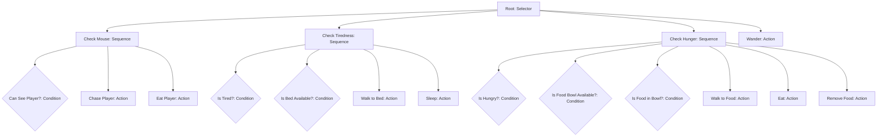

```mermaid
graph TD
	A[Root: Selector] --> B[Check Mouse: Sequence]
	A --> C[Check Tiredness: Sequence]
	A --> D[Check Hunger: Sequence]
	A --> E[Wander: Action]

	B --> F{Can See Player?: Condition}
	B --> G[Chase Player: Action]
	B --> H[Eat Player: Action]

	C --> I{Is Tired?: Condition}
	C --> J{Is Bed Available?: Condition}
	C --> K[Walk to Bed: Action]
	C --> L[Sleep: Action]

	D --> M{Is Hungry?: Condition}
	D --> N{Is Food Bowl Available?: Condition}
	D --> O{Is Food in Bowl?: Condition}
	D --> P[Walk to Food: Action]
	D --> Q[Eat: Action]
	D --> R[Remove Food: Action]
```
