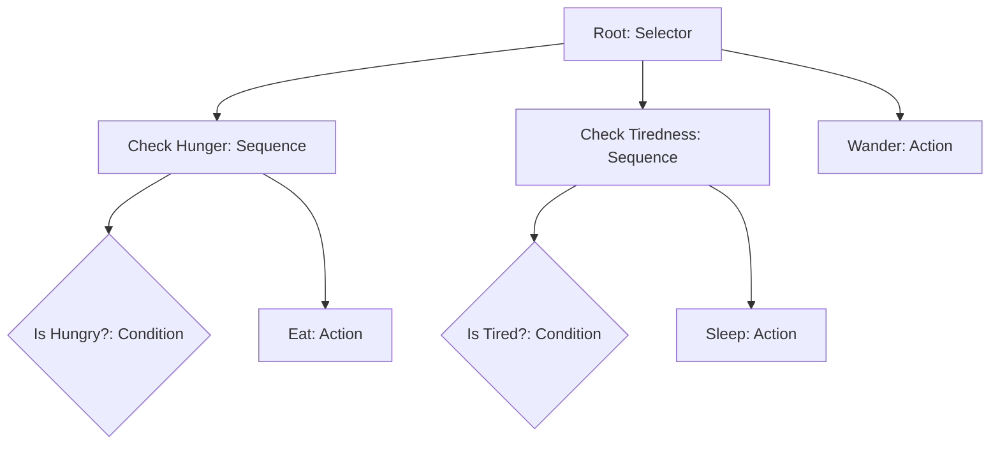

```mermaid
graph TD
A[Root: Selector] --> B[Check Hunger: Sequence]
A --> C[Check Tiredness: Sequence]
A --> D[Wander: Action]

	B --> E{Is Hungry?: Condition}
	B --> F[Eat: Action]

	C --> G{Is Tired?: Condition}
	C --> H[Sleep: Action]
```
