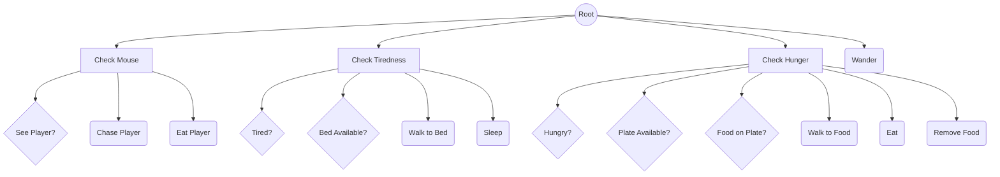

```mermaid
graph TD
	A((Root)) --> B[Check Mouse]
	A --> C[Check Tiredness]
	A --> D[Check Hunger]
	A --> E(Wander)

	B --> F{See Player?}
	B --> G(Chase Player)
	B --> H(Eat Player)

	C --> I{Tired?}
	C --> J{Bed Available?}
	C --> K(Walk to Bed)
	C --> L(Sleep)

	D --> M{Hungry?}
	D --> N{Plate Available?}
	D --> O{Food on Plate?}
	D --> P(Walk to Food)
	D --> Q(Eat)
	D --> R(Remove Food)
```
