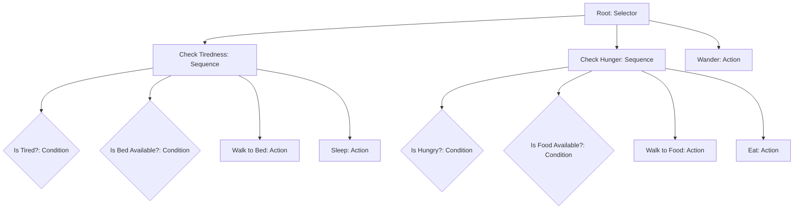

```mermaid
graph TD
    A[Root: Selector] --> B[Check Tiredness: Sequence]
    A --> C[Check Hunger: Sequence]
    A --> D[Wander: Action]

    B --> E{Is Tired?: Condition}
    B --> F{Is Bed Available?: Condition}
    B --> G[Walk to Bed: Action]
    B --> H[Sleep: Action]

    C --> I{Is Hungry?: Condition}
    C --> J{Is Food Available?: Condition}
    C --> K[Walk to Food: Action]
    C --> L[Eat: Action]
```
