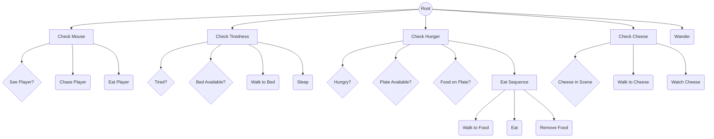

```mermaid
graph TD
	A((Root)) --> B[Check Mouse]
	A --> C[Check Tiredness]
	A --> D[Check Hunger]
	A --> T[Check Cheese]
	A --> E(Wander)

	B --> F{See Player?}
	B --> G(Chase Player)
	B --> H(Eat Player)

	C --> I{Tired?}
	C --> J{Bed Available?}
	C --> K(Walk to Bed)
	C --> L(Sleep)

	D --> M{Hungry?}
	D --> N{Plate Available?}
	D --> O{Food on Plate?}

	D --> P[Eat Sequence]

	P --> Q(Walk to Food)
	P --> R(Eat)
	P --> S(Remove Food)

	T --> U{Cheese in Scene}
	T --> V(Walk to Cheese)
	T --> W(Watch Cheese)
```
